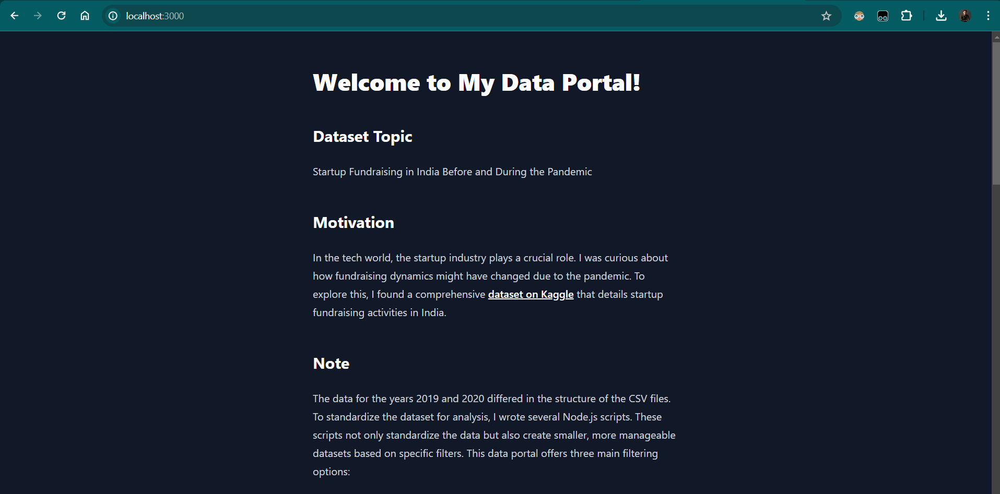

PortalJS Learn Example - https://portaljs.org/docs

# Startup Fundraising in India: Before and After the Pandemic

Explore interactive visualizations of startup fundraising activities in India, comparing data from before and after the COVID-19 pandemic. This data portal aims to uncover the impacts of the pandemic on the startup ecosystem in India.

## Motivation

In the dynamic tech landscape, startups play a pivotal role in innovation and economic growth. The onset of the COVID-19 pandemic has brought unprecedented challenges and changes to this sector. I was curious to explore how fundraising dynamics have shifted as a result of the pandemic. To facilitate this exploration, I've utilized a comprehensive dataset from [Kaggle](https://www.kaggle.com/datasets/arpan129/startups-funding-dataset), which details fundraising activities across various Indian startups.


## Features

- **Interactive Data Visualizations**: Line charts, flat UI tables, and interactive sortable tables showcasing detailed insights.
- **Dynamic Content Generation**: Automated generation of dataset-specific pages with markdown.
- **Filters and Sorting**: Enhanced user interaction with the ability to filter and sort data based on different criteria.

## Project Structure
- `/content`: Markdown pages based on folder names
- `/public`: Static files for the web portal.
- `/utils`: Utility scripts that enhance functionality.

## Setup and Installation

Ensure you have Node.js installed on your machine. Then follow these steps:

1. **Clone the repository**:
   ```bash
   git clone https://github.com/yourusername/your-repository-name.git
   cd your-repository-name
   ```

2. **Install dependencies**:
   ```bash
   npm install
   ```

3. **Prepare and standardize datasets**:
   ```bash
   npm run csv
   npm run datasets
   ```

4. **Update markdown files**:
   ```bash
   npm run mddb
   ```

5. **Run the development server**:
   ```bash
   npm run dev
   ```

   Visit `http://localhost:3000` to view the portal.

## Deployment

This project is deployed on [Vercel/Netlify/Cloudflare], and you can access it at [insert deployment URL here].

## Demo Video

For a walkthrough of this project, watch the demo video on Loom: [insert loom video link here].

Thank you for exploring the Startup Fundraising in India data portal!
