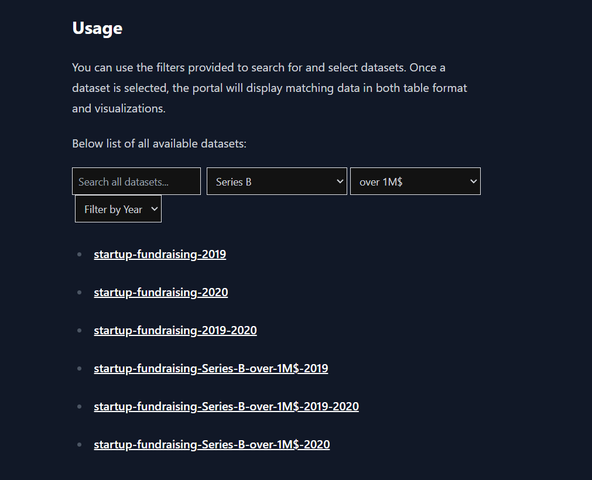

PortalJS Learn Example - https://portaljs.org/docs

# Startup Fundraising in India: Before and During the Pandemic


Explore interactive visualizations of startup fundraising activities in India, comparing data from before and after the COVID-19 pandemic. This data portal aims to uncover the impacts of the pandemic on the startup ecosystem in India.

## Motivation

In the dynamic tech landscape, startups play a pivotal role in innovation and economic growth. The onset of the COVID-19 pandemic has brought unprecedented challenges and changes to this sector. I was curious to explore how fundraising dynamics have shifted as a result of the pandemic. To facilitate this exploration, I've utilized a comprehensive dataset from [Kaggle](https://www.kaggle.com/datasets/arpan129/startups-funding-dataset), which details fundraising activities across various Indian startups.



# Issues

During the project development, several challenges were encountered:

- **Data Preparation**: The datasets for 2019 and 2020 were initially not prepared for processing and output, requiring standardization efforts due to differing data types and structures in the CSV files. This issue was addressed by developing Node.js scripts to harmonize data formats.

- **Script Functionality**: Two main scripts were developed to enhance data usability:
  - `npm run csv`: This script prepares and standardizes the datasets for the years 2019 and 2020, making them consistent and ready for further analysis.
  - `npm run datasets`: This script generates smaller, more manageable sub-datasets based on specific filtering conditions. These tailored datasets allow for focused analyses on particular aspects of the data.

## Data Filtering and Script Functionality

The project includes advanced data filtering options to provide tailored insights into startup fundraising activities:

- **Investment Type**: Users can filter data based on investment categories such as Seed, Series A, and Series B.
- **Amount (USD)**: The portal allows filtering of transactions to show those over or under 1 million USD.
- **Year of Fundraising**: Users can choose between the years 2019 and 2020 to compare how fundraising dynamics have changed.


## Features

- **Interactive Data Visualizations**: Line charts, flat UI tables, and interactive sortable tables showcasing detailed insights.
- **Dynamic Content Generation**: Automated generation of dataset-specific pages with markdown.
- **Filters and Sorting**: Enhanced user interaction with the ability to filter and sort data based on different criteria.

## Project Structure
- `/content`: Markdown pages based on folder names
- `/public`: Static files for the web portal.
- `/utils`: Utility scripts that enhance functionality.

## Setup and Installation

Ensure you have Node.js installed on your machine. Then follow these steps:

1. **Clone the repository**:
   ```bash
   git clone https://github.com/yourusername/your-repository-name.git
   cd your-repository-name
   ```

2. **Install dependencies**:
   ```bash
   npm install
   ```

3. **Prepare and standardize datasets**:
   ```bash
   npm run csv
   npm run datasets
   ```

4. **Update markdown files**:
   ```bash
   npm run mddb
   ```

5. **Run the development server**:
   ```bash
   npm run dev
   ```

   Visit `http://localhost:3000` to view the portal.

## Deployment

This project is deployed on [https://my-dataportal.vercel.app/], and you can access it at [insert deployment URL here].

## Demo Video

For a walkthrough of this project, watch the demo video on Loom: [insert loom video link here].

Thank you for exploring the Startup Fundraising in India data portal!
